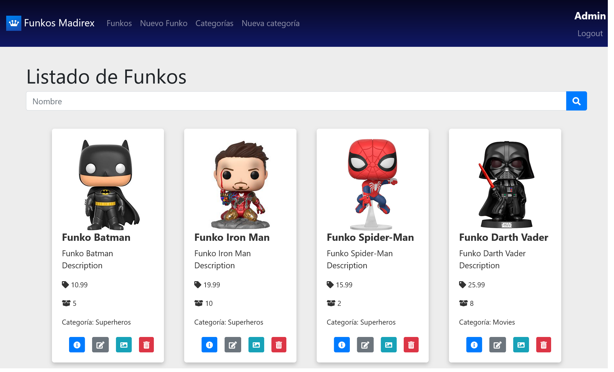
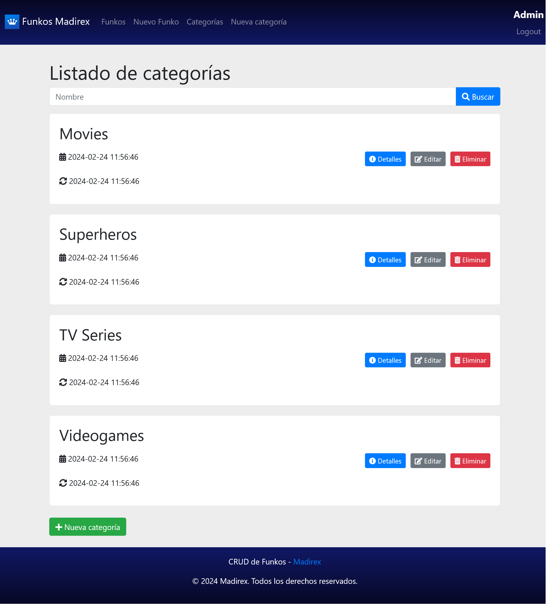

# laravel-rest-funkos
 API REST de Funkos en Laravel.

  

  

# ✏️⚠️ Instrucciones Importantes
## Configuración
1. Cambiar el nombre del archivo .env.example a .env
2. DEVELOP_MODE=true para activar el modo de desarrollo, DEVELOP_MODE=false para desactivar el modo de desarrollo. Esto es importante, pues en modo desarrollo la API está activada para poder ser testeada con Postman, pero en modo producción, la API está desactivada para evitar que se realicen cambios en la base de datos. Es importante que en modo de producción se deshabilite, o cualquiera podrá hacer cambios.

## Instrucciones
Para empezar, debes de ejecutar este comando para levantar sail
    
    sudo ./vendor/bin/sail up

1. Ejecutar Docker: docker-compose up -d
2. Ejecutar las migraciones: docker exec laravel-rest-funkos-laravel.test-1 php artisan migrate
3. Ejecutar los seeders: docker exec laravel-rest-funkos-laravel.test-1 php artisan db:seed
4. Ejecutar el comando npm run dev para compilar los archivos de JavaScript y CSS.

Deberás reemplazar el nombre del contenedor de Docker laravel-rest-funkos-laravel.test-1 por el nombre que haya asignado Docker.
Si lo prefieres, puedes realizar todos los pasos anteriores en un solo comando:

    CONTAINER_NAME="laravel-rest-bookstore-laravel.test-1" && sudo docker-compose up -d && sleep 1 && while ! sudo docker exec $CONTAINER_NAME php artisan migrate; do sleep 2; done && sudo docker exec $CONTAINER_NAME php artisan db:seed && echo "Migración exitosa. El servicio está iniciado." && npm run dev

Solo deberás cambiar el CONTAINER_NAME por el nombre del contenedor que te genera Docker y ya podrás ejecutar de una pasada todos los comandos anteriores.

Para eliminar el contenedor, junto con sus datos, puedes ejecutar el siguiente comando:

    docker-compose down -v --remove-orphans

Ambos comandos comentados pueden ser utilizados para iniciar y detener el contenedor de Docker. Es importante entender que cada vez que ejecutes el comando de docker-compose down -v  --remove-orphans se van a eliminar todos los datos de la base de datos. Solo se debería de utilizar en modo desarrollo, nunca en modo producción. ⚠️

📁❗ Ahora, para que funcione el storage deberás de crear el enlace a storage (EN EL CONTENEDOR DE DOCKER laravel-rest-funkos-laravel.test-1) Si no lo ejecutas en el contenedor, no se creará correctamente el enlace simbólico:

    php artisan storage:link

Por último, si te da fallos de permisos, ejecuta esto para cambiar los permisos de storage:
    
    sudo chmod -R a+rw storage

## Postman
🚀 Archivo de colección de pruebas Postman en este repositorio:
    
    📕 Laravel Funkos.postman_collection.json
